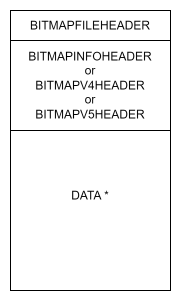

# ft_bitmap

## Table of Contents
1. [Introduction](#introduction)
2. [Installation](#installation)
3. [Usage](#usage)
4. [API Reference](#api-reference)

## Introduction
ft_bitmap is a lightweight and efficient C library for loading and handling bitmap (BMP) images. We wrote it to be aligned with 42 school norms, so you can use it in the school projects.
It supports both BMP v3 and BMP v5 specifications.
### Bitmap Storage
The established bitmap file format consists of a BITMAPFILEHEADER structure followed by a BITMAPINFOHEADER, BITMAPV4HEADER, or BITMAPV5HEADER structure, followed by the data segment shown in the following diagram.


In our case we only support BITMAPINFOHEADER and BITMAPV5HEADER structures, and the data segment is stored in a single contiguous block of memory. In ft_bitmap, bitmap structure is defined as follows:
```c
typedef struct s_ftbitmap
{
	t_bfheader		fh;
	t_biheader		ih;
	t_bv5header		v5ih;
	unsigned char	*data;
}	t_ftbitmap;
```
where `t_bfheader`, `t_biheader`, and `t_bv5header` are defined as follows:
```c
typedef struct s_bfheader
{
	uint8_t		bf_type[2];
	uint32_t	bf_size;
	uint16_t	bf_reserved1;
	uint16_t	bf_reserved2;
	uint32_t	bf_off_bits;
}	t_bfheader;

typedef struct s_biheader
{
	uint32_t	bi_size;
	int32_t		bi_width;
	int32_t		bi_height;
	uint16_t	bi_planes;
	uint16_t	bi_bit_count;
	uint32_t	bi_compression;
	uint32_t	bi_size_image;
	int32_t		bi_x_pels_per_meter;
	int32_t		bi_y_pels_per_meter;
	uint32_t	bi_clr_used;
	uint32_t	bi_clr_important;
}	t_biheader;

typedef struct s_biv5header
{
	uint32_t	bi_red_mask;
	uint32_t	bi_green_mask;
	uint32_t	bi_blue_mask;
	uint32_t	bi_alpha_mask;
	uint32_t	bi_cst_type;
	uint32_t	bi_endpoints[9];
	uint32_t	bi_gamma_red;
	uint32_t	bi_gamma_green;
	uint32_t	bi_gamma_blue;
	uint32_t	bi_intent;
	uint32_t	bi_profile_data;
	uint32_t	bi_profile_size;
	uint32_t	bi_reserved;
}	t_biv5header;
```
Note here that in the `t_biv5header` structure, we only have the fields that are missing in the `t_biheader` structure. For more information about the bitmap file format, you can refer to the [Microsoft documentation](https://learn.microsoft.com/en-us/windows/win32/gdi/bitmap-storage).

Here is a list of implemented features:
- [x] Load bitmap from file.
- [x] Save bitmap to file.
- [x] Create an empty bitmap with a specified width and height.
- [x] Get the pixel address at a specified position.
- [x] Free the bitmap memory.
- [ ] Get the pixel color at a specified position.
- [ ] Set the pixel color at a specified position.

## Installation

1. Clone the repository:
```bash
git clone https://github.com/KarenDanielyan/ft_bitmap
cd ft_bitmap
```
2. Build the library:
```bash
make
```
3. Link the library to your project (script cosidering that you are in the library directory):
```bash
gcc -o my_project my_project.c -I. -L. -lftbitmap
```

## Usage

Here is an example of how to use the library:
```c
#include <ft_bitmap.h>

int main(void)
{
	t_ftbitmap	*bitmap;

	bitmap = ft_create_bitmap(1920, 1080);
	ft_destroy_bitmap(bitmap);
	bitmap = ft_load_bitmap("example.bmp");
	ft_destory_bitmap(bitmap);
	return (0);
}
```

## API Reference

### Functions

- `t_ftbitmap *ft_create_bitmap(int width, int height);`
	- Creates an empty bitmap with the specified width and height. It fills the bitmap with white color.
	- Returns a pointer to the created bitmap.
	- It will return NULL if the memory allocation fails.
- `t_ftbitmap *ft_load_bitmap(const char *filename);`
	- Loads a bitmap from the specified file.
	- Returns a pointer to the loaded bitmap.
	- It will return NULL if the file does not exist or the memory allocation fails.
- `int ft_save_bitmap(const t_ftbitmap *bitmap, const char *filename);`
	- Saves the bitmap to the specified file.
	- Returns 0 on success, -1 on failure.
- `void ft_destroy_bitmap(t_ftbitmap *bitmap);`
	- Frees the memory allocated for the bitmap.
- `unsigned char *ft_bitmap_get_pixel(t_ftbitmap *bitmap, uint32_t x, uint32_t y);`
	- Returns a pointer to the pixel at the specified position.
	- The pixel is represented as an array of bytes in the order RGB or RGBA.
	- It will return NULL if the position is out of bounds.
- `uint32_t ft_bitmap_get_stride(const t_ftbitmap *bitmap);`
	- Returns the number of bytes in a row of the bitmap.
	- Stride is the number of bytes needed to store a row of pixels in memory, including the padding.